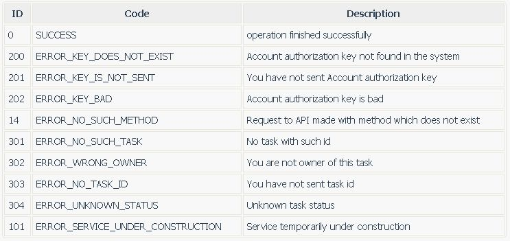

PHP class to generate clean universal understandable descriptions of errors.
===

Basicaly used for API. But in fact it was so easy to use it that now I use it almost in every complex php function.

Example
===

Let's begin with quick example.

Include code with library

```
require_once('class_errorer/functions_errorer.php');
```

<a name='errors'></a>

Init the class with all possible errors
```
$errors = "
	errorId	errorCode	errorDescription

	700	ERROR_URLS_NOT_ENOUGH	Not enough urls
	701	ERROR_MYSQL_INSERT_TASK	Mysql error, can't insert task
	702	ERROR_MYSQL_UPDATE_URLS	Mysql error, can't update urls
	703	ERROR_NO_SUCH_TASK	No such task in the system
	";

$E = new Errorer($errors);

```

Each error consists of errorId, errorCode and errorDescriptionid.
Write all possible errors. You should write them from new line, one line concists of 3 values of `errorId	errorCode	errorDescription` delimited by the Tabulation.

Now we can start our `bestOfTheWorldFunction(some arguments)` and inside it can happens some special error... Or not :)

If we have some special error return it
---

```
if ($error)	{
	return $E->res_error('ERROR_NO_SUCH_TASK');
}

```

The `Errorer` will search for `errorCode` with value `ERROR_NO_SUCH_TASK`, found it and return the answer

```
{
	"errorId":301,
	"errorCode":"ERROR_NO_SUCH_TASK",
	"errorDescription":"No task with such id",
}
```

You can return more detailes on that error:
```
return $E->res_error('ERROR_NO_SUCH_TASK', "searching for id 1000");
```
will give us

```
{
	"errorId":301,
	"errorCode":"ERROR_NO_SUCH_TASK",
	"errorDescription":"No task with such id",
	"errorDetails":"searching for id 1000"
}
```


If we have no errors
---

In final of successfull calculations return the result with `E->res_success()`

```
$calculated = array(
	"status"=>"processing",
);

return $E->res_success($calculated);
```

The response will be:
```
{
	"status":"processing",
	"errorId":0
}
```

Typical workflow
===

Your function should always return the result with `E->res_success()` or `E->res_error()`. The result of this functions will always has the key `errorId`. If the value of `errorId` equals `0` this means that everything is correctly calculated. Othervise (`errorId` is greater than 0) full information about the error is available through `errorCode`, `errorDescription` and `ErrorDetails`.


Detailed description of all keys of `$E->res_error`
===

`$E->res_error` will return the dictionary with information about the error.

You should describe all possible errors in the [initial error list](#errors).

`errorId` (type Integer) : Error identificator.

	* 0 : no errors, the function finished without any error
	* >0 : error identificator. Error code and short information transferred in `errorCode` and `errorDescription` properties. Optional `errorDetails` with details.

`errorCode` (type String) : Error code.

`errorDescription` (type String) : Short information describing error.

`errorDetails` (type String) : Details about the error. OPTIONAL.

More possibilities
===

Return table with description of all your errors
---

Use function `$E->get_html_error_description()` to get the string containing html table with description of all errors
It is very usefull to use it when you write Help Page for you  api.



FAQ
===

*Why do you use errorID, it seems that errorCode is enough?*
> You are right :) But usually you want to do one thing after critical error and another after general error. If you'll use ids>1000 for all you critical errors you will be able just with one check `if ($errorId>1000)` to do corresponding action in case of any critical error.
